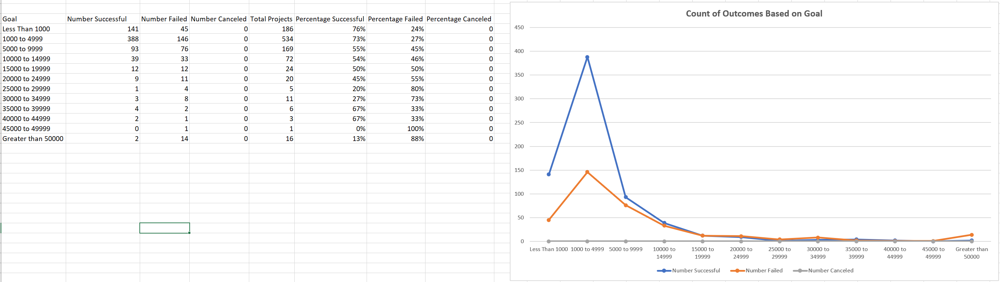

# Kickstarting with Excel

## Overview of Project

### Purpose
As Louise's fundraising campaign for the play Fever came close to its goal, she began to wonder how different campaigns fared in relation to their launch dates and funding goals.

The purpose of this project is to perform an analysis and visualizations on the kickstarter dataset. The analysis and visualization would help Louise understand the relations of how fundraising outcomes would vary based on launch date and based on goals.

## Analysis and Challenges

### Analysis of Outcomes Based on Launch Date

There are a few steps to perform an analysis of outcomes based on launch date.

First, the "Category and Subcategory" column is separated into 2 columns, the Parent Category and Subcategory columns are created by using the Text to Column function with 3 steps.
Step 1:

After that, the Date_Created_Conversion and Date_Ended_Conversion are created by converting the "launched_at" and "deadline" column using a formula shown below.

Next, the Year column is created by extracting the year information from the "Date Created Conversion" column using a formula.

The pivot table is inserted using the whole dataset, with the following fields, as shown below.

Lastly, With the filters on parent category being "theater", a line graph is inserted using the information from the pivot table, showing theater outcomes based on launch date.

### Analysis of Outcomes Based on Goals

To perform an analysis of outcomes based on goals, first, a table with rows of the range of goals from 0 to 50000, with columns being number of each outcome, total projects, as well as percentage of each outcome is created.
The numbers of each outcomes are computed from the "Goal" column of the dataset and the COUNTIFS formula. The first criteria being the different range of goals, the second being "successful", "failed", and "canceled" from the "Outcome" column from the dataset, while the last being "plays" from the "Subcategory" column from the dataset.
The number of "Total Projects" are calculated by using the SUM formula, adding the "successful", "failed", and "canceled" columns for each range of goal, while the perecentage of each cell is calculated by rounding the division of each outcome by the total to the nearest integer. The formats of the columns for percentage are also changed to "percentage".

Using the table, a line graph is created using the "Goal" column and the 3 other columns of "percentage successful", "percentage failed" and "percentage canceled".

### Challenges and Difficulties Encountered

There were no specific challenges and difficulties encountered when performing the data analysis. However, some time and effort was taken to brainstorm for the limitations of the dataset as well as additional tables and graphs to better analyze the situation.

## Results

### Conclusions about the Outcomes based on Launch Date

- What are two conclusions you can draw about the Outcomes based on Launch Date?

By looking at the line graph of Theater Outcomes by Launch Date, which combines data from all the years, two conclusions can be drawn. First, at any given month, there are more successful outcomes than failed outcomes. Second, over the years, there has been an upward trend of successful outcomes for the first 5 months, followed by a downward trend of successful outcomes for the next 7 months. However, there is no significant trend for the failed outcomes.

### Conclusions about the Outcomes based on Goals

- What can you conclude about the Outcomes based on Goals?

By looking at the line graph of Outcomes Based on Goals, it is obvious that there is no canceled outcomes for any goal. Overall there is a downward trend where the higher amount the goal is, the less percentage of successful outcomes. On the other hand, there is an upward trend where the higher amount the goal is, the higher percentage of failed outcomes.

### Limitations of this dataset

- What are some limitations of this dataset?

There are some limitations of this dataset which may affect its effectiveness and representation. It has a relatively small percentage of data for the category "theater" gathered from 2009 to 2013, as well as 2017. Since data for the category are mostly concentrated between 2014 and 2016, it may be biased or skewed, affecting the overall accuracy of the analysis.

Moreover, by switching the country filter in the "Outcome based on Goals" chart, it is shown that most of the data gathered are from the "US". Since most of the data source are from one country, it may be demographically biased, thus affecting the accuracy of the analysis. The analysis will only be credible if Louise's play will be played in the US as she did not specify in which country her play is going to be played.

### Additional tables and graphs

- What are some other possible tables and/or graphs that we could create?

There are two possible tables and graphs that we could create to better analyze the situation. 
First, a "Backers on Plays" line graph demonstrates the actual number of backers over the years on the plays subcategory. It shows that there has been a spike in number of backers on plays between 2014 and 2016.

Second, an "Average Donation on Plays" line graph can be created to demonstrate the average donation over the years on the plays subcategory as well. It shows that there has been a slight increase in average donation per year.

Lastly, a "Count of Outcomes Based on Goal" line graph can be used to display the actual count of outcomes based on goal. It demonstrates clearly that the highest count of successful outcome comes from the goal that ranges between 1000 and 4999.
This may be useful for setting goals for future fundraising campaign.

These additional tables and graphs can be used better understand the big picture of the number of backers and average donation over the years in different subcategory, as well as the total count of outcomes based on goal.  
